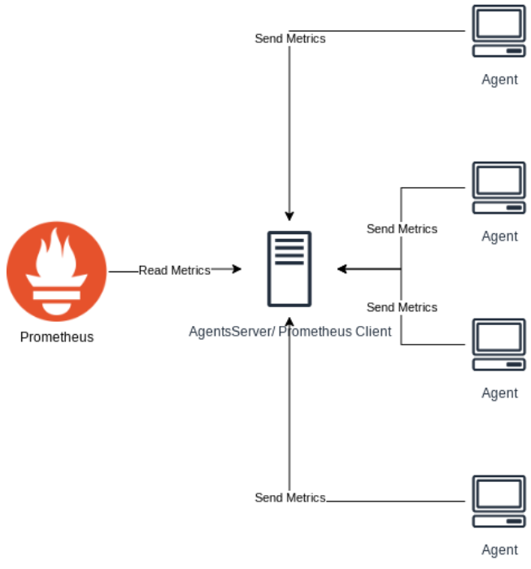

# socket-prometheus
This program uses python socket programming to create a TCP client-server connection, and sends the data to a prometheus server using the [prometheus-client](https://github.com/prometheus/client_python) library. An overview of the system is show in the figure bellow.

